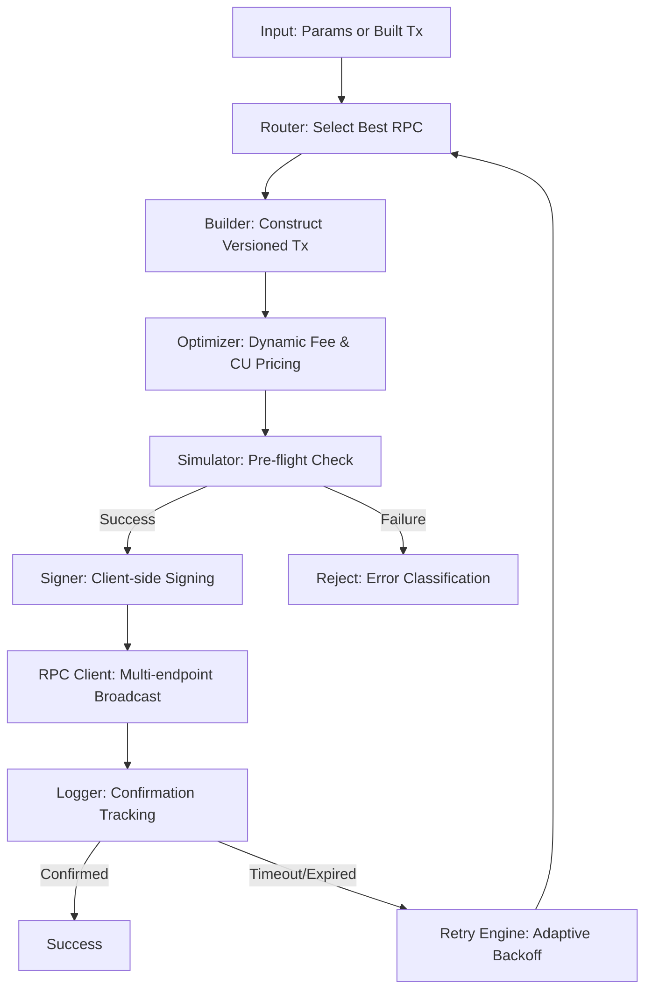

# Sendra Architecture

Sendra is designed as a modular reliability layer for Solana transactions. It abstracts the complexities of network congestion, RPC instability, and execution monitoring into a single unified pipeline.

## The Execution Pipeline

The core logic resides in `@repo/core` through the `sendWithReliability` function. Every transaction flows through the following stages:

## Core Components

### 1. Adaptive Retry Engine (`@repo/retry-engine`)
Unlike static retry loops, Sendra's engine classifies failures (e.g., blockhash expired, slippage, congestion) and adapts the strategy:
- **Blockhash Expiration:** Re-fetches fresh blockhash and rebuilds the transaction.
- **Congestion:** Increases priority fees before rebroadcasting.
- **RPC Error:** Switches to a different provider immediately.

### 2. Intelligent Routing (`@repo/router`)
The router monitors the latency and health of multiple RPC endpoints. It ensures that transactions are sent to the most responsive node and provides instant failover if an endpoint goes down.

### 3. Fee Optimization (`@repo/fee-optimizer`)
Dynamic calculation of `ComputeBudget` instructions. It uses recent network metrics to set priority fees that ensure inclusion without overpaying, along with precise Compute Unit limits based on simulation.

### 4. High-Fidelity Logging (`@repo/logger`)
Sendra generates exhaustive telemetry for every execution.
- **Console Logs:** Real-time visibility into the pipeline stages.
- **File Logs:** Persistent storage in `/sendra-logs` for post-mortem analysis.
- **Confirmation Tracker:** Deep monitoring of transaction status across multiple nodes to handle "forked" confirmations.

### 5. Dashboard Flow (`apps/web`)
The dashboard provides a visual layer over the SDK's execution. It connects to the internal logging system to show real-time metrics, RPC performance, and success rates across different environments.

## Modular Package Architecture

Sendra is built on a **"Decoupled but Integrated"** philosophy:
- Each package in `packages/` is standalone and can be used independently.
- `@repo/types` provides a shared contract between all components.
- The monorepo structure ensures that improvements to the `fee-optimizer` or `router` are immediately available across the SDK and the Dashboard.

## Security Considerations
- **Non-Custodial:** Sendra never stores private keys. Signing happens entirely within the caller's environment.
- **Simulation First:** Transactions are always simulated before signing to prevent predictable losses or failed fee captures.
